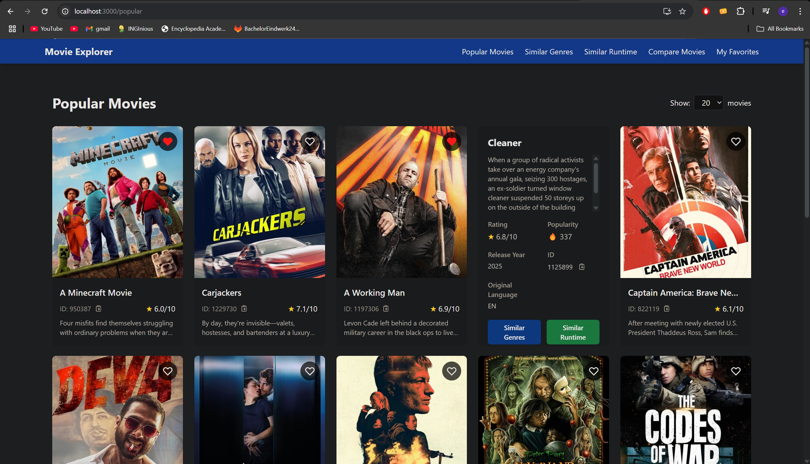

**First name:** Elias

**Last name:** El Bouzidi

---

## Explain how your API follows the RESTful principles.

**Statelessness**  
- Each request contains all necessary information (API key in headers).  
- No server-side session storage is used.

**Resource-Based URLs**  
- Endpoints follow a logical structure (e.g., `/movies/`, `/movies/popular`, `/movies/random`, `/movies/{movie_id}/similar-genres`).
- URLs use nouns not verbs
- URLs are short
- URLs are hackable up the tree
- URLs are meaningful
- URLs are resource-oriented
- URLs are permanent
- URLs are predictable and human-readable
- Query arguments are only for parameters
- URLs avoid extensions

**HTTP Methods**  
- `GET` for retrieving data (e.g., `/movies/popular`).  
- `POST` for creating resources (e.g., `/movies/favorites/{movie_id}`).  
- `DELETE` for removing resources (e.g., `/movies/favorites/{movie_id}`).

**Standard Status Codes**  
- `200 OK` for successful requests.  
- `400 Bad Request` for invalid parameters.  
- `401 Unauthorized` for missing/invalid API keys.  
- `404 Not Found` for missing resources.  
- `500 Internal Server Error` for unexpected failures.

**JSON Responses**  
- All endpoints return structured JSON responses.

**Cacheability**  
- Responses are explicitly marked as cacheable where appropriate (e.g., `/movies/random` is cached for 5 minutes).

---

## [Optional] Motivate your design decisions. Are there any designs you considered but decided not to implement? Why?

### Design Choices

**API Key Authentication**  
- Ensures only authorized users can access the API.  
- Simple to implement and manage.

**Rate Limiting**  
- Prevents abuse (e.g., 10 requests/minute for `/movies/random`).  
- Protects backend services from excessive load.
- Protects against harmfull attacks like DoS attack.

**Caching**  
- Reduces redundant calls to TMDB (e.g., genre-based recommendations are cached for 5 minutes).  
- Improves response times for repeated queries.
- Helps reducing the load of the server

**Frontend Integration**  
- Built with React + TypeScript + Tailwind CSS for a responsive UI.  
- Uses `fetch()` to interact with the API.

### Alternatives Considered

**JWT Authentication**  
- More complex than API keys but unnecessary for this use case.  
- API keys are sufficient for a small-scale service.

**Database for Favorites**  
- Currently, favorites are stored in-memory (`favorites = []`).  
- A database (e.g., SQLite) would be better for persistence.

---

## Discuss efficiency. How would you improve the performance optimization of your API?

### Current Optimizations
✅ **Caching** (Flask-Caching)  
- Reduces redundant TMDB API calls.
- Improves performance
- Example: `/movies/random` cached for 5 minutes.

✅ **Rate Limiting** (Flask-Limiter)  
- Prevents abuse and ensures fair usage.

✅ **Batch Requests**  
- `/movies/compare` fetches multiple movies in one request.

### Future Improvements

- **Database Caching**: Store frequently accessed data (e.g., popular movies) in a local database.
- **Asynchronous Requests**: Use `async/await` with libraries like `aiohttp` for parallel TMDB requests.
- **CDN for Static Assets**: Serve frontend assets via a CDN for faster load times.
- **Load Balancing**: Deploy multiple instances behind a load balancer for scalability.

---

## Fault tolerance: Can your API handle faulty requests? If so, what kind of errors does it address, and how are they handled?

### Error Handling

| Error Type          | Example                     | Handling                     |
|---------------------|-----------------------------|------------------------------|
| Invalid API Key     | Missing `API-Key` header    | Returns 401 Unauthorized     |
| Invalid Parameters  | `n=100` (max: 20)           | Returns 400 Bad Request      |
| Movie Not Found     | Invalid `movie_id`          | Returns 404 Not Found        |
| Rate Limit Exceeded | Too many requests           | Returns 429 Too Many Requests|
| Server Errors       | TMDB API down               | Returns 500 Internal Server Error |

### Recovery Mechanisms

- **Retry Logic** (Frontend can retry failed requests).  
- **Graceful Degradation** (If `/movies/random` fails, suggest cached popular movies).

---

## [Extension] Carefully discuss your extensions. Describe what you have added and why. If you implemented additional technologies or algorithms, explain what they do, and how they function.

### 1. Caching (Flask-Caching)
- **What?** Caches responses to avoid redundant TMDB API calls.  
- **Why?** Reduces latency and API quota usage.  
- **How?** Uses `@cache.cached(timeout=300)` decorator.
- **Use:** Caches based on query parameters or arguments

### 2. Rate Limiting (Flask-Limiter)
- **What?** Limits requests per minute per endpoint.  
- **Why?** Prevents abuse and ensures fair usage.  
- **How?** Uses `@limiter.limit("10/minute")`.

### 3. API Key Authentication
- **What?** Requires `API-Key` header for all requests.  
- **Why?** Ensures only authorized users access the API.  
- **How?** Validates keys via `verify_api_key()`.

### 4. Frontend (React + TypeScript + Tailwind CSS)
- **What?** A responsive UI to interact with the API.  
- **Why?** Provides a user-friendly way to explore movies.  
- **How?** Uses `fetch()` for API calls and Tailwind for styling.
- **How to run?** Run the **start_frontend.sh** script, which will install the necessary packages and start the server
- **Example picture:** 

---

## How many hours did you spend on this assignment?

- **Backend (API):** ~10 hours  
- **Frontend (React):** ~10 hours  
- **Testing & Debugging:** ~5 hours  
- **Total:** ~25 hours
